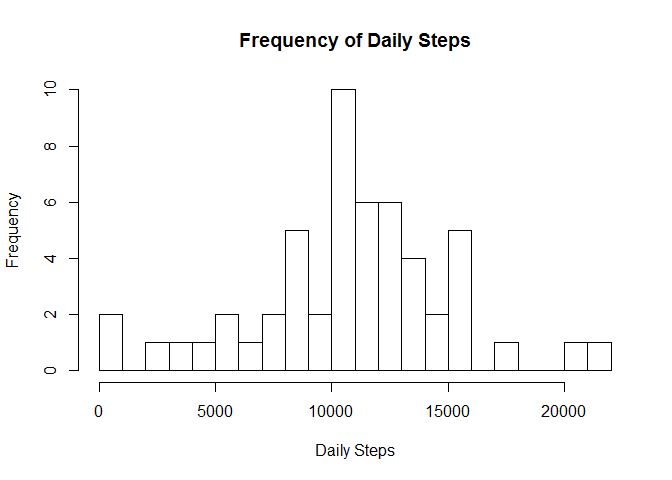
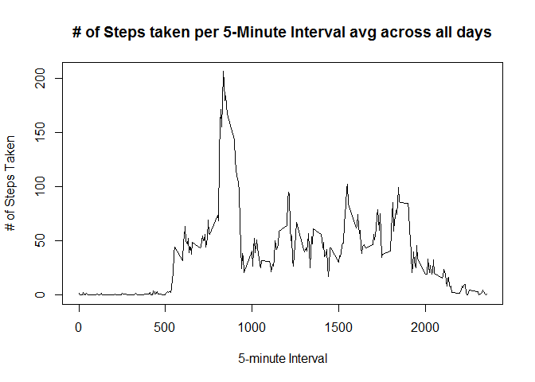
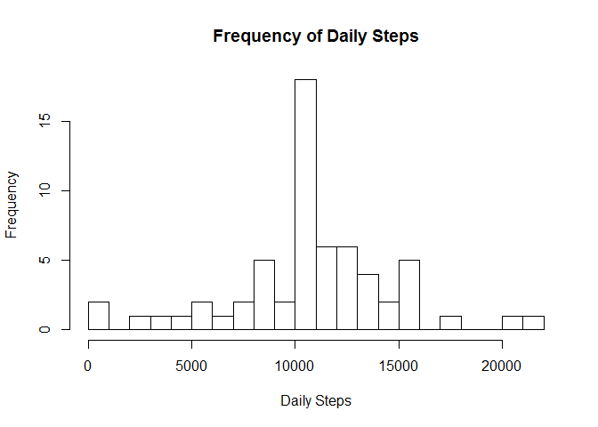
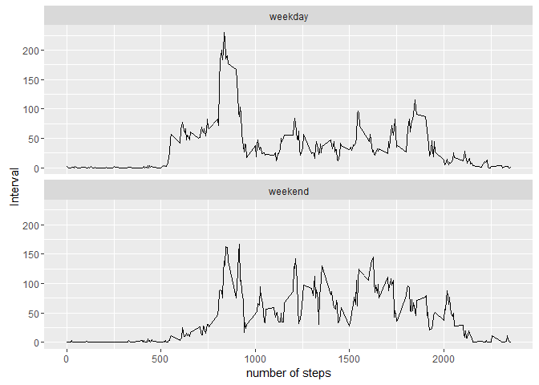

# Reproducible Research: Peer Assessment 1


## Loading and preprocessing the data
The source data was downloaded from https://d396qusza40orc.cloudfront.net/repdata%2Fdata%2Factivity.zip


```r
library(ggplot2)
# Load the Data from original data file
ActivityData <- read.csv("activity.csv")

#Convert Date Factor to type date
ActivityData$date <- as.Date(ActivityData$date)
```

## What is mean total number of steps taken per day?

```r
DailySteps <- aggregate(steps ~ date, ActivityData, sum)

#plot histogram of Total number of steps per day 
hist(DailySteps$steps, 
     length(DailySteps$date),
     breaks = 20,
     main="Frequency of Daily Steps",
     xlab = "Daily Steps")
```

\
The Mean and Median of daily steps taken

```r
#mean and medium values
output <- data.frame( Mean = mean(DailySteps$steps), Median = median(DailySteps$steps))
output
```

```
##       Mean Median
## 1 10766.19  10765
```


## What is the average daily activity pattern?

```r
# Avg # of steps per increment, average across all the days
IncrementAvg <- aggregate(steps ~ interval, ActivityData, mean)

#Plot Time Series
plot(IncrementAvg$interval, 
     IncrementAvg$steps, 
     type="l", 
     main = "# of Steps taken per 5-Minute Interval avg across all days",
     xlab = "5-minute Interval",
     ylab = "# of Steps Taken"
     )
```

\
The interval with the maxium number of average steps across all days:

```r
IncrementAvg[IncrementAvg$steps==max(IncrementAvg$steps),]$interval
```

```
## [1] 835
```


## Imputing missing values
The avg number of steps per interval over all days is used to impute the missing data.

```r
# Logical vector of missing values
Missing = is.na(ActivityData$steps)

# Number of missing values (na) for Steps
sum(Missing)
```

```
## [1] 2304
```

```r
# Copy Orginal Data
ActivityData2 <- ActivityData

# Impute avg steps/increment for missing values
ActivityData2$steps[Missing] <- 
        sapply(ActivityData2$interval[Missing],
               function(x) { IncrementAvg$steps[IncrementAvg$interval==x] }
               )

# Aggregate the data with the imputed data.
DailySteps2 <- aggregate(steps ~ date, ActivityData2, sum)

#plot histogram of Total number of steps per day of data with missing values imputed
hist(DailySteps2$steps, 
     length(DailySteps2$date),
     breaks = 20,
     main="Frequency of Daily Steps",
     xlab = "Daily Steps")
```

\
The histogram has a similar shape as the original data, overall the frequencies are higher.

The Mean and Medium of daily steps with imputed missing data.

```r
#Mean and Median
output2 <- data.frame( Mean = mean(DailySteps2$steps), Median = median(DailySteps2$steps))
output2
```

```
##       Mean   Median
## 1 10766.19 10766.19
```


## Are there differences in activity patterns between weekdays and weekends?

```r
# Generate array of weekdays
wd <- weekdays(ActivityData2$date,TRUE)

# Convert to array of factors ("weeday" or "weekend")
weekend <- factor((wd=="Sun"| wd=="Sat"), labels=c("weekday","weekend") )

# Add weeend array to data.frame
ActivityData3 <- cbind(ActivityData2, weekend)

# Avg # of steps per increment, average across all the days
IncrementAvg2 <- aggregate(steps ~ interval + weekend, ActivityData3, mean)

#Plot timeseries data in two panel plot, weekdays vs weekends
g = ggplot(IncrementAvg2, aes(interval,steps)) + 
        geom_line() + 
        facet_wrap(~weekend, ncol = 1) + 
        labs(x="number of steps",
             y="Interval")
g
```

\
The weekdays and weekend days have a similar shape.  The weekday steps start earlier in the day, the number of steps tends to be higher on weekends.
